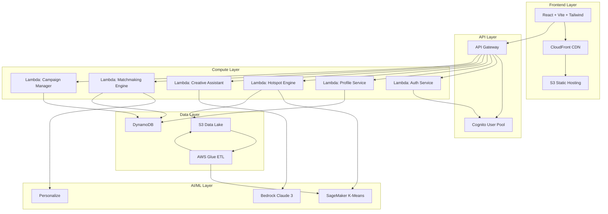
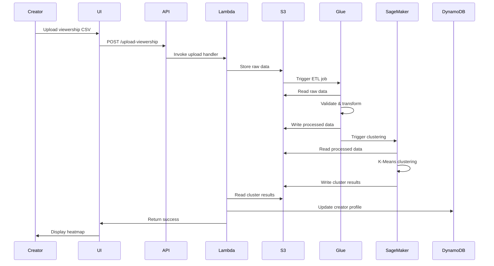

# Design Document: Local Lens

## Overview

Local Lens is a serverless AI platform built on AWS that connects Indian MSMEs with regional content creators through data-driven geographic insights. The platform leverages a fully serverless architecture to provide cost-effective, scalable marketing intelligence.

The system consists of five major components:
1. **Viewer Hotspot Engine**: AI-powered clustering using SageMaker K-Means
2. **Creative Assistant**: Generative AI using Amazon Bedrock (Claude 3 Haiku)
3. **Matchmaking Engine**: Recommendation system using Amazon Personalize
4. **Campaign Manager**: Collaboration workflow management
5. **Auth Service**: Social authentication via Amazon Cognito

The architecture follows serverless best practices with React frontend on CloudFront/S3, Python FastAPI on Lambda, API Gateway for routing, DynamoDB for transactional data, and S3 for data lake storage.

## Architecture

### High-Level Architecture



### Data Flow Architecture



## Components and Interfaces

### 1. Auth Service

**Purpose**: Handle user authentication and authorization using Amazon Cognito.

**Technology**: Python FastAPI on AWS Lambda, Amazon Cognito User Pool

**Interfaces**:

```python
# POST /auth/login
def initiate_social_login(provider: str) -> dict:
    """
    Initiate social login flow
    
    Args:
        provider: "google" or "facebook"
    
    Returns:
        {
            "redirect_url": str,  # Cognito hosted UI URL
            "state": str          # CSRF token
        }
    """

# GET /auth/callback
def handle_auth_callback(code: str, state: str) -> dict:
    """
    Handle OAuth callback from Cognito
    
    Args:
        code: Authorization code
        state: CSRF token
    
    Returns:
        {
            "access_token": str,
            "id_token": str,
            "refresh_token": str,
            "user_id": str,
            "email": str
        }
    """

# POST /auth/logout
def logout(access_token: str) -> dict:
    """
    Invalidate user session
    
    Args:
        access_token: User's access token
    
    Returns:
        {"success": bool}
    """

# POST /auth/refresh
def refresh_token(refresh_token: str) -> dict:
    """
    Refresh expired access token
    
    Args:
        refresh_token: User's refresh token
    
    Returns:
        {
            "access_token": str,
            "id_token": str
        }
    """
```

### 2. Profile Service

**Purpose**: Manage user profiles for business owners and content creators.

**Technology**: Python FastAPI on AWS Lambda, DynamoDB

**Interfaces**:

```python
# Data Models
class BusinessProfile:
    user_id: str
    profile_type: str = "business"
    business_name: str
    pincode: str
    industry_category: str
    contact_email: str
    contact_phone: str
    target_radius_km: int
    created_at: str
    updated_at: str

class CreatorProfile:
    user_id: str
    profile_type: str = "creator"
    creator_name: str
    content_category: list[str]
    languages: list[str]
    social_links: dict[str, str]
    viewership_data_url: str
    total_viewers: int
    top_pincodes: list[str]
    cluster_data: dict
    created_at: str
    updated_at: str

# POST /profiles/business
def create_business_profile(profile: BusinessProfile, user_id: str) -> dict:
    """
    Create business owner profile
    
    Args:
        profile: Business profile data
        user_id: Authenticated user ID
    
    Returns:
        {
            "profile_id": str,
            "profile": BusinessProfile
        }
    """

# POST /profiles/creator
def create_creator_profile(profile: CreatorProfile, user_id: str) -> dict:
    """
    Create content creator profile
    
    Args:
        profile: Creator profile data
        user_id: Authenticated user ID
    
    Returns:
        {
            "profile_id": str,
            "profile": CreatorProfile
        }
    """

# GET /profiles/{user_id}
def get_profile(user_id: str) -> dict:
    """
    Retrieve user profile
    
    Args:
        user_id: User identifier
    
    Returns:
        BusinessProfile or CreatorProfile
    """

# PUT /profiles/{user_id}
def update_profile(user_id: str, updates: dict) -> dict:
    """
    Update user profile
    
    Args:
        user_id: User identifier
        updates: Fields to update
    
    Returns:
        Updated profile
    """

# POST /profiles/creator/upload-viewership
def upload_viewership_data(user_id: str, file: bytes, format: str) -> dict:
    """
    Upload viewership data file
    
    Args:
        user_id: Creator user ID
        file: CSV or JSON file bytes
        format: "csv" or "json"
    
    Returns:
        {
            "upload_id": str,
            "s3_key": str,
            "status": "processing"
        }
    """
```

### 3. Viewer Hotspot Engine

**Purpose**: Cluster viewers by geographic location and generate heatmap data.

**Technology**: Python FastAPI on AWS Lambda, AWS Glue, SageMaker K-Means, S3

**Interfaces**:

```python
# Data Models
class ViewerRecord:
    pincode: str
    viewer_count: int
    state: str
    district: str
    latitude: float
    longitude: float

class ClusterResult:
    cluster_id: int
    centroid_pincode: str
    centroid_lat: float
    centroid_lon: float
    total_viewers: int
    pincodes: list[str]

class HeatmapData:
    clusters: list[ClusterResult]
    pincode_data: list[dict]
    total_viewers: int
    top_regions: list[str]

# POST /hotspot/trigger-clustering
def trigger_clustering(user_id: str, upload_id: str) -> dict:
    """
    Trigger clustering job for uploaded viewership data
    
    Args:
        user_id: Creator user ID
        upload_id: Viewership upload identifier
    
    Returns:
        {
            "job_id": str,
            "status": "started",
            "estimated_time_seconds": int
        }
    """

# GET /hotspot/clustering-status/{job_id}
def get_clustering_status(job_id: str) -> dict:
    """
    Check clustering job status
    
    Args:
        job_id: Clustering job identifier
    
    Returns:
        {
            "job_id": str,
            "status": "processing" | "completed" | "failed",
            "progress_percent": int,
            "error": str | None
        }
    """

# GET /hotspot/heatmap/{user_id}
def get_heatmap_data(user_id: str) -> HeatmapData:
    """
    Retrieve heatmap visualization data
    
    Args:
        user_id: Creator user ID
    
    Returns:
        HeatmapData with clusters and pincode information
    """
```

**Clustering Algorithm**:

```python
def perform_kmeans_clustering(viewership_data: list[ViewerRecord], n_clusters: int = 5) -> list[ClusterResult]:
    """
    Perform K-Means clustering on viewership data
    
    Algorithm:
    1. Extract features: [latitude, longitude, log(viewer_count)]
    2. Normalize features using StandardScaler
    3. Apply K-Means with n_clusters (default 5)
    4. Calculate cluster centroids and aggregate viewer counts
    5. Map pincodes to clusters
    
    Args:
        viewership_data: List of viewer records with pincode and counts
        n_clusters: Number of clusters (default 5)
    
    Returns:
        List of cluster results with centroids and member pincodes
    """
```

### 4. Creative Assistant

**Purpose**: Generate localized marketing scripts using generative AI.

**Technology**: Python FastAPI on AWS Lambda, Amazon Bedrock (Claude 3 Haiku)

**Interfaces**:

```python
# Data Models
class ScriptRequest:
    business_description: str
    target_audience: str
    language: str  # "tamil", "hindi", "telugu"
    tone: str = "professional"  # "professional", "casual", "enthusiastic"
    duration_seconds: int = 30

class ScriptResponse:
    script_id: str
    script_text: str
    language: str
    word_count: int
    estimated_duration_seconds: int
    created_at: str

# POST /creative/generate-script
def generate_marketing_script(request: ScriptRequest, user_id: str) -> ScriptResponse:
    """
    Generate localized marketing script using AI
    
    Args:
        request: Script generation parameters
        user_id: Business owner user ID
    
    Returns:
        Generated script with metadata
    """

# POST /creative/regenerate-script
def regenerate_script(script_id: str, modifications: dict) -> ScriptResponse:
    """
    Regenerate script with modifications
    
    Args:
        script_id: Previous script identifier
        modifications: Changes to apply (tone, length, etc.)
    
    Returns:
        New script version
    """

# GET /creative/scripts/{user_id}
def get_user_scripts(user_id: str, limit: int = 10) -> list[ScriptResponse]:
    """
    Retrieve user's generated scripts
    
    Args:
        user_id: Business owner user ID
        limit: Maximum scripts to return
    
    Returns:
        List of previously generated scripts
    """
```

**Prompt Engineering**:

```python
def build_script_prompt(request: ScriptRequest, business_profile: BusinessProfile) -> str:
    """
    Build prompt for Claude 3 Haiku
    
    Template:
    You are a marketing expert specializing in Indian regional markets.
    
    Business: {business_name}
    Industry: {industry_category}
    Location: {pincode}
    Target Audience: {target_audience}
    
    Create a {duration_seconds}-second marketing script in {language} with a {tone} tone.
    The script should:
    - Be culturally relevant for Tier 2/3 Indian cities
    - Use simple, relatable language
    - Include a clear call-to-action
    - Be authentic and engaging
    
    Business Description: {business_description}
    
    Generate only the script text, no additional commentary.
    """
```

### 5. Matchmaking Engine

**Purpose**: Recommend content creators to businesses based on geographic and demographic overlap.

**Technology**: Python FastAPI on AWS Lambda, Amazon Personalize, DynamoDB

**Interfaces**:

```python
# Data Models
class MatchCriteria:
    target_pincode: str
    radius_km: int
    content_categories: list[str]
    min_viewers: int = 1000
    languages: list[str]

class CreatorMatch:
    creator_id: str
    creator_name: str
    match_score: float  # 0-100
    overlap_percentage: float
    overlapping_pincodes: list[str]
    total_viewers_in_target: int
    content_category: list[str]
    languages: list[str]
    social_links: dict[str, str]

# POST /matchmaking/search
def search_creators(criteria: MatchCriteria, user_id: str) -> list[CreatorMatch]:
    """
    Search for matching creators
    
    Args:
        criteria: Search and filtering criteria
        user_id: Business owner user ID
    
    Returns:
        List of creators ranked by match score
    """

# GET /matchmaking/recommendations/{user_id}
def get_personalized_recommendations(user_id: str, limit: int = 10) -> list[CreatorMatch]:
    """
    Get personalized creator recommendations using Amazon Personalize
    
    Args:
        user_id: Business owner user ID
        limit: Maximum recommendations
    
    Returns:
        Personalized list of creator matches
    """

# POST /matchmaking/interaction
def record_interaction(user_id: str, creator_id: str, interaction_type: str) -> dict:
    """
    Record user interaction for personalization
    
    Args:
        user_id: Business owner user ID
        creator_id: Creator user ID
        interaction_type: "view", "contact", "campaign_created"
    
    Returns:
        {"success": bool}
    """
```

**Matching Algorithm**:

```python
def calculate_match_score(business: BusinessProfile, creator: CreatorProfile) -> float:
    """
    Calculate match score between business and creator
    
    Scoring components:
    1. Geographic overlap (50%): Percentage of creator's viewers in business target area
    2. Category relevance (30%): Jaccard similarity of content categories
    3. Language match (10%): Number of matching languages
    4. Viewer volume (10%): Log-scaled total viewers in target area
    
    Returns:
        Match score from 0-100
    """
```

### 6. Campaign Manager

**Purpose**: Manage collaboration requests between businesses and creators.

**Technology**: Python FastAPI on AWS Lambda, DynamoDB, Amazon SNS

**Interfaces**:

```python
# Data Models
class Campaign:
    campaign_id: str
    business_id: str
    creator_id: str
    campaign_name: str
    description: str
    budget_min: int
    budget_max: int
    collaboration_type: str  # "sponsored_post", "brand_ambassador", "event_promotion"
    status: str  # "pending", "accepted", "declined", "completed", "cancelled"
    created_at: str
    updated_at: str
    response_message: str = None

# POST /campaigns/create
def create_campaign(campaign: Campaign, user_id: str) -> dict:
    """
    Create collaboration request
    
    Args:
        campaign: Campaign details
        user_id: Business owner user ID
    
    Returns:
        {
            "campaign_id": str,
            "campaign": Campaign,
            "notification_sent": bool
        }
    """

# GET /campaigns/business/{user_id}
def get_business_campaigns(user_id: str, status: str = None) -> list[Campaign]:
    """
    Get campaigns created by business
    
    Args:
        user_id: Business owner user ID
        status: Optional status filter
    
    Returns:
        List of campaigns
    """

# GET /campaigns/creator/{user_id}
def get_creator_campaigns(user_id: str, status: str = None) -> list[Campaign]:
    """
    Get campaigns received by creator
    
    Args:
        user_id: Creator user ID
        status: Optional status filter
    
    Returns:
        List of campaigns
    """

# PUT /campaigns/{campaign_id}/respond
def respond_to_campaign(campaign_id: str, user_id: str, action: str, message: str = None) -> dict:
    """
    Respond to campaign request
    
    Args:
        campaign_id: Campaign identifier
        user_id: Creator user ID
        action: "accept" or "decline"
        message: Optional response message
    
    Returns:
        {
            "campaign": Campaign,
            "notification_sent": bool
        }
    """

# PUT /campaigns/{campaign_id}/cancel
def cancel_campaign(campaign_id: str, user_id: str) -> dict:
    """
    Cancel campaign request
    
    Args:
        campaign_id: Campaign identifier
        user_id: Business owner user ID
    
    Returns:
        {"success": bool}
    """
```

### 7. ETL Pipeline

**Purpose**: Process and transform viewership data for AI analysis.

**Technology**: AWS Glue (PySpark), S3

**Pipeline Stages**:

```python
# Stage 1: Data Validation
def validate_viewership_data(raw_data: DataFrame) -> DataFrame:
    """
    Validate uploaded viewership data
    
    Validations:
    - Required columns: pincode, viewer_count
    - Pincode format: 6-digit Indian postal code
    - Viewer count: positive integer
    - Remove duplicates by pincode
    - Filter out invalid pincodes
    
    Returns:
        Validated DataFrame
    """

# Stage 2: Data Enrichment
def enrich_with_geo_data(validated_data: DataFrame, pincode_master: DataFrame) -> DataFrame:
    """
    Enrich viewership data with geographic information
    
    Enrichment:
    - Join with pincode master data
    - Add state, district, latitude, longitude
    - Calculate distance from major cities
    
    Returns:
        Enriched DataFrame
    """

# Stage 3: Data Aggregation
def aggregate_viewership(enriched_data: DataFrame) -> DataFrame:
    """
    Aggregate viewership metrics
    
    Aggregations:
    - Total viewers by pincode
    - Total viewers by district
    - Total viewers by state
    - Top N pincodes by viewer count
    
    Returns:
        Aggregated DataFrame
    """

# Stage 4: Feature Engineering
def engineer_clustering_features(aggregated_data: DataFrame) -> DataFrame:
    """
    Create features for K-Means clustering
    
    Features:
    - Normalized latitude/longitude
    - Log-scaled viewer count
    - Viewer density (viewers per sq km)
    
    Returns:
        Feature DataFrame ready for SageMaker
    """
```

## Data Models

### DynamoDB Tables

**Table 1: Users**
```python
{
    "user_id": str,  # Partition Key
    "email": str,
    "profile_type": str,  # "business" or "creator"
    "cognito_sub": str,
    "created_at": str,
    "last_login": str
}
```

**Table 2: Profiles**
```python
{
    "user_id": str,  # Partition Key
    "profile_type": str,  # Sort Key
    "profile_data": dict,  # BusinessProfile or CreatorProfile
    "pincode": str,  # GSI Partition Key for geographic queries
    "created_at": str,
    "updated_at": str
}
```

**Table 3: Campaigns**
```python
{
    "campaign_id": str,  # Partition Key
    "business_id": str,  # GSI Partition Key
    "creator_id": str,  # GSI Partition Key
    "campaign_name": str,
    "description": str,
    "budget_min": int,
    "budget_max": int,
    "collaboration_type": str,
    "status": str,
    "created_at": str,
    "updated_at": str,
    "response_message": str
}
```

**Table 4: Interactions**
```python
{
    "interaction_id": str,  # Partition Key
    "user_id": str,  # GSI Partition Key
    "creator_id": str,
    "interaction_type": str,
    "timestamp": str,
    "metadata": dict
}
```

### S3 Data Lake Structure

```
s3://local-lens-data-lake/
├── raw/
│   └── viewership/
│       └── {user_id}/
│           └── {upload_id}/
│               └── data.csv
├── processed/
│   └── viewership/
│       └── {user_id}/
│           └── {upload_id}/
│               ├── validated.parquet
│               ├── enriched.parquet
│               └── features.parquet
├── clusters/
│   └── {user_id}/
│       └── {job_id}/
│           ├── model/
│           └── results.json
└── pincode-master/
    └── india-pincodes.parquet
```


## Correctness Properties

A property is a characteristic or behavior that should hold true across all valid executions of a system—essentially, a formal statement about what the system should do. Properties serve as the bridge between human-readable specifications and machine-verifiable correctness guarantees.

### Property Reflection

After analyzing all acceptance criteria, I identified several areas of redundancy:

- Requirements 7.3 and 7.4 both test match score ranking and can be combined into a single comprehensive property
- Requirements 9.3 and 9.4 test similar state transitions (accept vs decline) and can be unified
- Requirements 14.3 and 14.4 test rate limiting at different thresholds but follow the same pattern
- Several round-trip properties (2.3, 11.5) test data persistence and can be generalized

The following properties represent the unique, non-redundant correctness guarantees:

### Authentication Properties

**Property 1: Social login redirect generation**
*For any* valid social login provider (Google, Facebook), the Auth_Service should generate a valid Cognito redirect URL with proper state token.
**Validates: Requirements 1.2**

**Property 2: Successful authentication creates session**
*For any* successful authentication response from Cognito, the Auth_Service should return a valid session token to the client.
**Validates: Requirements 1.3**

**Property 3: Profile creation validity**
*For any* new profile creation request, the system should strictly validate that the pincode is a 6-digit integer and the business name is not empty before writing to DynamoDB.
**Validates: Requirements 2.2, 2.3**

**Property 4: AI Script Generation Latency**
*For any* script generation request, the system must enforce a timeout of 29 seconds (Lambda limit) and return a fallback error if Bedrock does not respond, ensuring the UI never hangs indefinitely.
**Validates: Requirements 6.3, 12.2**